# Excalead
> Continuous formal verification auditing for Solana smart contracts

  

    
    
    
  

  

## ⚡ The Problem

Smart contract audits are currently **episodic, expensive, and manual**.
* **Slow:** Audits take weeks to schedule and complete.
* **Costly:** Formal verification is usually reserved for the top 1% of protocols due to cost.
* **Outdated:** By the time an audit report is PDF'd, the code has often already changed.

## 🛡️ The Solution: Excalead

We combine the rigor of the **[Rocq (Coq)](https://rocq-prover.org/)** proof assistant with the speed of **AI automation** to bring formal methods to every Solana developer.

Instead of relying solely on human eyes, Excalead mathematically proves that your implementation matches your **high-level logic** and avoid **common vulnerabilities**.

## 🤖 How it Works

We use a hybrid approach to verify equivalence between your actual code and the intended behavior.

```mermaid
graph TD
    %% Styles
    classDef rust fill:#000000,stroke:#ffffff,stroke-width:2px,color:#fff;
    classDef rocq fill:#1867C0,stroke:#000,stroke-width:2px,color:#fff;
    classDef spec fill:#14F195,stroke:#000,stroke-width:2px,color:#000;
    classDef ai fill:#9945FF,stroke:#000,stroke-width:2px,color:#fff;

    subgraph "Source Code"
        Code[🦀 Solana Rust/Anchor Code]:::rust
    end

    subgraph "Excalead"
        Rocq["🛡️ Rocq (Coq) Model With Anchor Primitives"]:::rocq
        HighLevel[📝 Higher-Level Model]:::spec
        HighLevel -->|Invariants Verification| Result{✅ Verified / ❌ Potential Exploit}
    end

    %% Relationships
    Code --->|AI-Assisted Translation| Rocq
    Rocq --->|Snapshot Testing| Code
    Rocq --->|AI-Assisted Translation| HighLevel
    HighLevel --->|Equivalence Proof| Rocq
```

1. **Lifting**: We translate the smart contract source code into a Rocq model, calling axiomatized Anchor primitives. This translation can be done quickly thanks to the widespread use of AI, and we verify it with snapshot testing to make sure it behaves as the original code.
2. **Specification**: We define a Higher-Level Model of the code to give the expected behavior, with exact arithmetic (real numbers) and a unified state (no PDAs), for example. This helps describe the intended behavior of the code, and checks for common vulnerabilities, like incorrect rounding or account validation.
3. **Verification**: We check that the higher-level model is mathematically equivalent to the Rocq model of the source, and verify custom invariants corresponding to the business logic of the smart contract.

A critical part is verifying that the Rocq model is equivalent to the smart contract code in Rust by testing. Our approach is to serialize everything in JSON back and forth between Rocq and Rust, to check by snapshot testing that our model corresponds to the implementation:

## 🚀 Key Features

- **Automated** and **Lightweight Formal Methods**: No need to go down to the implementation details of Rust, verify a higher-level model of your code instead. A full verification can always be done later, reusing the same models.
- **Subscription Model**: Continuous security updates rather than one-off consulting fees.
- **Solana-Native**: Built specifically for the complexities of the Solana account model and Anchor framework.

## 🛠️ Tech Stack

- Input: Rust / Anchor Framework
- Formal Engine: Rocq (Coq) Prover
- Automation: LLMs from your preferred text editor or agentic IDE, together with custom scripts to generate snapshot tests between Rust and Rocq.

## 🤝 For Auditors & Developers

Excalead is designed to augment, but not replace, the security auditing done by humans.

- For **Developers**: You get quicker and more reliable feedback on the security of your smart contracts.
- For **Auditors**: Use the Excalead framework to mathematically verify complex properties and follow the evolutions of the smart contracts you verify.

## ✔️ Audited

- [🐖 PiggyBank](https://www.piggybank.fi/)
- [⚔️ Domin8](https://x.com/domin8Arena)

## 📬 Contact & Status

- Status: Private Beta; contact us to test it out!
- X: [@Excalead](https://x.com/Excalead)

Built for the Solana [Cypherpunk Colosseum](https://www.colosseum.com/cypherpunk) Hackathon.

  

