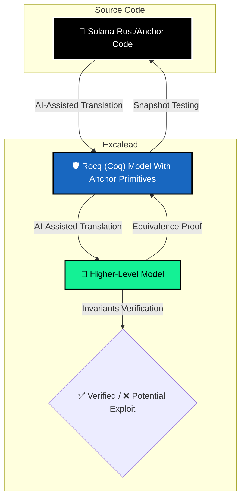

# Excalead
> Continuous formal verification for Solana smart contracts

  

    
    
    
  

```mermaid
graph TD
    %% Styles
    classDef rust fill:#000000,stroke:#ffffff,stroke-width:2px,color:#fff;
    classDef rocq fill:#1867C0,stroke:#000,stroke-width:2px,color:#fff;
    classDef spec fill:#14F195,stroke:#000,stroke-width:2px,color:#000;
    classDef ai fill:#9945FF,stroke:#000,stroke-width:2px,color:#fff;

    subgraph "Source Code"
        Code[🦀 Solana Rust/Anchor Code]:::rust
    end

    subgraph "Excalead"
        Rocq["🛡️ Rocq (Coq) Model With Anchor Primitives"]:::rocq
        HighLevel[📝 Higher-Level Model]:::spec
        HighLevel -->|Invariants Verification| Result{✅ Verified / ❌ Potential Exploit}
    end

    %% Relationships
    Code --->|AI-Assisted Translation| Rocq
    Rocq --->|Snapshot Testing| Code
    Rocq --->|AI-Assisted Translation| HighLevel
    HighLevel --->|Equivalence Proof| Rocq
```
